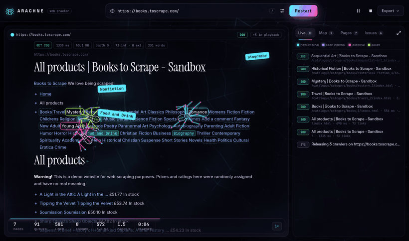
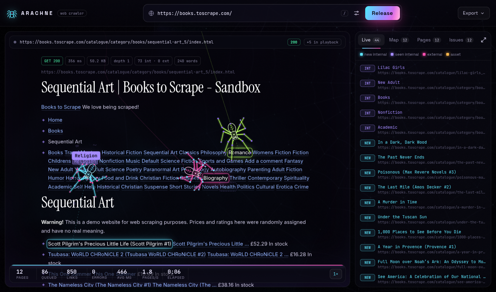
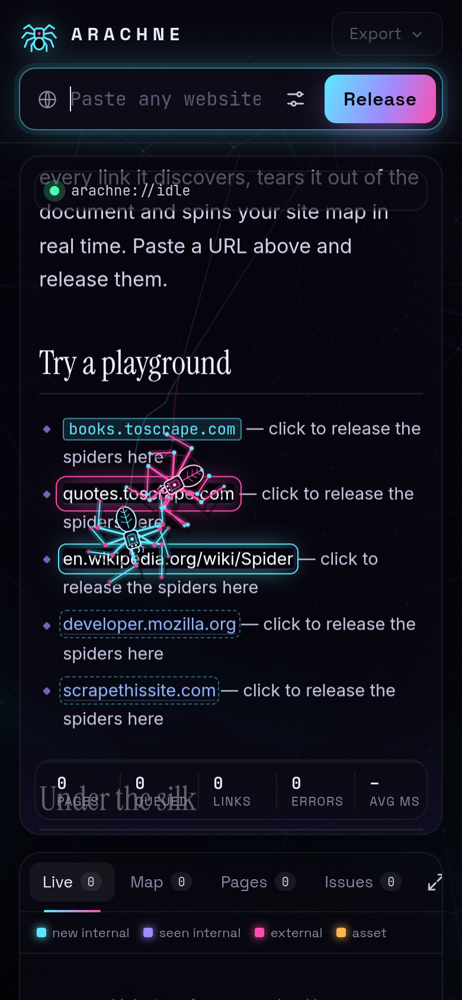

<div align="center">

# 🕷 Arachne

### Crawl the web. *Watch it crawl.*

A fast, polite, concurrent web crawler with a living visual. Every crawler worker is a procedurally animated spider. It walks across the page it is reading, bites each link it discovers, tears it out of the document and spins your site map in real time.



</div>

---

## ✨ Highlights

### The crawler
- **Concurrent worker pool** (1–8 workers) with **per-host rate limiting**
- **robots.txt aware**, including `Crawl-delay` and the `Sitemap:` directive
- **Sitemap seeding**: reads `sitemap.xml` and sitemap indexes to find pages that nothing links to
- **URL normalisation**: strips fragments, default ports and tracking params (`utm_*`, `fbclid`, `gclid`…), sorts query strings and dedupes
- **Retries with back-off** on network errors, `429` and `503` (honours `Retry-After`)
- **Manual redirect following** with a hop limit, so every hop is safety-checked
- **SSRF protection**: refuses hosts that resolve to private, loopback or link-local addresses
- **Streaming body reads** with a 6 MB cap, plus charset detection from headers and `<meta>`
- Respects `<meta name="robots" content="nofollow">` and `rel="nofollow"`

### When a site says "no"
Many sites block crawlers with Cloudflare/Akamai bot walls. Arachne **does not try to sneak past bot protection**. Instead it keeps the show going:
- **🕰 Time-travel**: when a page is refused (401/403/429/451/503, a Cloudflare challenge or a dead connection), the spiders fetch a public archived copy instead, so the crawl continues "in the past":
  - **Internet Archive (Wayback Machine)**: raw `id_` snapshots keep the original links. If the newest capture is itself a bot wall, the CDX index is asked for the latest real `200` capture.
  - **Common Crawl**: one prefix query maps every archived page of the site (and seeds the queue with them). Each page is then pulled straight out of its WARC file with an HTTP range request. Busy-index errors are retried with back-off, and an unreachable Wayback Machine is skipped for a while.
  - Once the start page is refused, the whole crawl switches to archive mode and stays polite. It can be turned off in Settings.
- **🛡 Firewall scene**: refused pages become a glowing shield with a giant status code. The spiders chew its digits and bricks to pieces.
- **Error pages are still read**: custom 404 pages usually contain site navigation, so the crawl carries on. A 404 start URL also retries the home page.
- **🧪 Built-in sandbox**: type `sandbox` (or pick it on the home screen) to crawl *The Spider Atlas*. It is a generated site with 400+ pages, redirects, broken links, missing alt text and descriptions, a robots.txt disallow, and sitemap-only orphan pages. It always works, even offline.

### The audit
Every page is checked for missing or overlong titles and descriptions, missing or multiple `<h1>`, missing alt text, canonical problems, `noindex`, thin content, missing Open Graph tags, heavy HTML, plain-HTTP pages, slow responses, redirects, and 4xx/5xx responses or failed requests. It also collects JSON-LD schema types, emails and the in-link graph.

### Exports
- **JSON**: the full report
- **CSV**: one row per page, opens in Excel or Sheets
- **sitemap.xml**: ready to submit; only indexable 2xx HTML pages, canonical URLs preferred

### The visual
- **Procedural spiders**: two-bone IK legs, an alternating tetrapod gait with velocity-predicted foot placement, planted feet, spring steering with burst speed, body bob, lunging fangs and twitching pedipalps. One spider per worker, each with its own neon colour.
- **Real pages, re-rendered**: each crawled page becomes a readable "sheet" that keeps its real headings, paragraphs and inline links. Spiders hunt the actual links.
- **Link life-cycle**: queued → targeted (reticle + bite thread) → grabbed (text scramble, glyph shards) → torn out and flown along a silk thread into the live feed
- **Silk**: draglines behind every spider, plus web strands between harvested links that build up as the page is eaten
- **Page corruption**: RGB-split, slice and font-swap glitches near the spiders
- **Reactive WebGL background**: a nebula and a giant orb web that vibrates with a shockwave on every request
- **Live site map**: a force-directed graph of pages and links (grid-accelerated physics, pan, zoom, hover, click for details)
- **Adaptive pacing**: when the crawler outruns the animation, playback speeds up and shows fewer bites per page, so the show never falls behind
- Cursor-curious idle spiders, click-to-poke, scroll to take the camera, `prefers-reduced-motion` support, and a fully responsive mobile layout

<div align="center">


</div>

---

## 🚀 Quick start

Requires **Node.js 20+**.

```bash
git clone https://github.com/Vivek2998/arachne-web-crawler.git
cd arachne-web-crawler
npm install

# development: API on :4173, Vite dev server on :5173
npm run dev

# production
npm run build
npm start           # http://localhost:4173
```

Open the app, paste a URL and hit **Release**. Want a guaranteed playground? Type `sandbox`, or try `books.toscrape.com` / `quotes.toscrape.com`.

### Configuration

Click the **settings** icon next to the URL bar:

| Setting | Default | |
|---|---|---|
| Max pages | 150 | stops after this many fetches |
| Max depth | 4 | link hops from the start URL |
| Spiders (concurrency) | 3 | parallel workers; up to 4 are drawn |
| Delay | 120 ms | minimum gap between requests to the same host |
| Timeout | 15 s | per request |
| Respect robots.txt | on | |
| Seed from sitemap.xml | on | |
| Include subdomains | off | `blog.example.com` counts as internal |
| Time-travel | on | use an archived copy (Internet Archive / Common Crawl) when a site refuses crawlers |

Server environment variables:

| Variable | Default | |
|---|---|---|
| `PORT` | `4173` | HTTP port |
| `MAX_SESSIONS` | `6` | concurrent crawls allowed |
| `ALLOW_PRIVATE_NETWORKS` | unset | set to `1` to crawl localhost / LAN targets |

---

## 🔌 API

The UI is a client of a small HTTP API, so you can script it as well:

```http
POST /api/crawl                     { "url": "https://example.com", "options": { "maxPages": 50 } }
GET  /api/crawl/:id/events          Server-Sent Events: init, fetch, page, fail, stats, log, done
POST /api/crawl/:id/pause | resume | stop
GET  /api/crawl/:id/export.json | export.csv | export.xml
```

The event stream supports `Last-Event-ID`, so reconnecting clients replay what they missed.

---

## 🧱 Architecture

```
server/
  index.js       Express app: crawl sessions, SSE stream with replay, exports
  crawler.js     worker pool, robots.txt, sitemaps, politeness, retries, redirects
  extract.js     HTML → metadata, links, SEO audit, and a reading-view snapshot
  url-utils.js   normalisation, scope rules, SSRF guard
  sandbox.js     the built-in generated "Spider Atlas" website
client/src/
  spider.ts      procedural spider: IK legs, gait, steering, rendering
  stage.ts       page sheets, camera, spider choreography, silk, flying links
  background.ts  WebGL2 nebula + orb web with crawl shockwaves
  graph.ts       force-directed live site map
  main.ts        UI wiring, feed, pages table, issues, details, settings
```

No UI framework. Rendering is hand-written Canvas 2D + WebGL2 in a single `requestAnimationFrame` loop with frame-rate-independent damping, so motion stays smooth at 60/120 Hz.

---

## 🙏 Credits

Visual concept inspired by **Slava Rybin** ([@rybinfx](https://www.instagram.com/rybinfx/)), whose animation shows web crawlers as tiny digital spiders.

## 📄 License

[MIT](LICENSE) © Vivek Kumar
